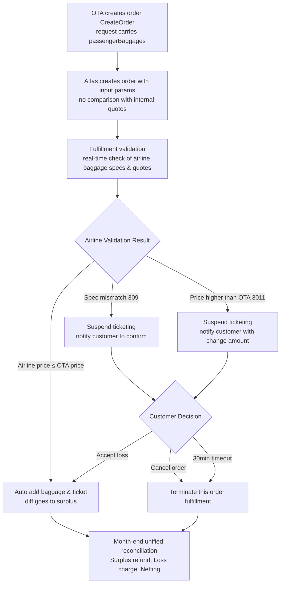
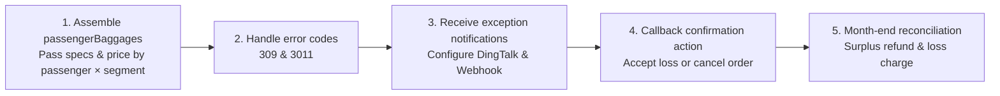

# China OTA Baggage Integration



For scenarios where Chinese OTAs sell baggage alongside ticket bookings, Atlas provides an end-to-end capability: "baggage information pass-through → automated fulfillment → exception confirmation → monthly settlement". This enables stable ticketing for OTA-collected baggage orders with unified "surplus refund, deficit charge" settlement at month-end.

## Quick Reference · Key Agreements

| Item | Conclusion |
|----|----|
| Price Benchmark | Use OTA input prices directly for order creation, **no comparison with Atlas internal pricing** |
| Validation Party | Airline (returns `309` / `3011`) |
| Loss Acceptance Timeout | **30 minutes**；unconfirmed orders are automatically canceled after timeout |
| Loss Acceptance Callback | ① API `POST /confirmBaggageLoss.do` (pass `orderNo`)；② atrip page click |
| Order Cancellation | **Reuse existing cancel order interface** |
| Exception Notification | DingTalk group notification (existing) + Webhook (existing) |
| Settlement | Unified month-end reconciliation, surplus refund / loss charge, with netting |

---

## Problems Solved

| Pain Point | This Solution's Response |
|----|----|
| OTA has already sold baggage to passengers, but baggage specs/prices are OTA-proprietary | Atlas **does NOT compare/replace with internal baggage quotes**, directly creates orders using OTA-provided specs and prices |
| Airline actual price at fulfillment differs from OTA selling price, risking loss or disputes | Real-time airline price validation：**profit generates rebate, loss requires confirmation first**, unified netting settlement at month-end |
| Spec non-compliance with airline requirements causes entire order failure | Independent `309` exception notification，confirm first then handle |
| Loss order appeal later requires screenshots | Clear screenshot responsibility attribution，pre-agreed in process |

---

## Core Business Process



---

## Key Business Rules

### Baggage Info Pass-Through（Order Creation Stage）

When calling the Atlas create order interface（`CreateOrder` / `POST /order.do`），customers pass in baggage already sold by OTA：

* Baggage **type/specs**（weight-based or piece-based, weight, pieces, checked/carry-on）；
* OTA-side **sales amount & currency**；
* Baggage **passenger**；
* Baggage **flight segment**（linked by flight number）。


**Important**：Atlas **does NOT compare and match with own quotes**，directly creates orders using customer input parameters.


### Automated Fulfillment Rules

During fulfillment，system validates in real-time actual purchasable baggage specs and prices from the airline side：

* **Airline actual price ≤ OTA selling price**：automatically complete baggage add-on and ticketing，**diff surplus is refunded to customer as rebate in month-end statement**。

### Exception Handling Rules

During fulfillment，if any of the following occur，system **suspends automatic ticketing and notifies customer to confirm**：

| Trigger Condition | Error Code | Meaning |
|----|----|----|
| Customer-provided baggage specs do not meet airline requirements | **309** | Specs not purchasable，order cannot continue confirmation |
| Airline actual quote is higher than OTA selling price | **3011** | Price change（loss risk），notification includes change amount |

**Notification Methods**：

* DingTalk group notification（**already supported**）；
* Webhook notification（**already supported**）。

**Customer options after receiving notification**：

1. **Cancel Order**：Atlas terminates fulfillment for this order（**reuse existing cancel order interface**）。
2. **Accept Loss**：After customer confirmation，Atlas continues automatic baggage add-on and ticketing；the resulting loss amount is combined with rebate amount for month-end reconciliation。
   * System will flag such orders；flagged orders support customer "**loss acceptance**"，system auto-accepts price change for ticketing。
   * **Confirmation window is 30 minutes**；**unconfirmed orders after 30 minutes will be automatically canceled**。

### Screenshot Clarification（Voucher Responsibility）

For **loss-accepted orders**，if the Chinese OTA needs airline official website screenshots for subsequent appeals，**Atlas does not provide related screenshots**。

Customer should，after receiving **loss order completion notification**，independently go to airline official website to check order and save screenshots，for later appeal or internal audit。

### Month-End Unified Settlement

During month-end reconciliation，Atlas aggregates all China OTA baggage add-on orders，and uniformly calculates：

* **Surplus amount** from baggage add-on → refund to customer；
* **Loss amount** from baggage add-on → charge to customer；

Final settlement is reflected in **month-end statement**，completed on **netting basis**。

---

## Settlement Example

| Scenario | OTA Selling Price | Airline Actual Price | Outcome | Month-End Settlement |
|----|----|----|----|----|
| Surplus | 30 USD | 25 USD | Auto ticketing | Refund customer **5 USD** |
| Loss（Confirmed） | 30 USD | 35 USD | Customer accepts loss then tickets | Charge customer **5 USD** |

---

# Part 2 · FAQ / Q&A

## I. Basic Understanding

### Q1. What is "baggage add-on with order"？

It refers to the scenario where a passenger，**during the flight booking process** on a Chinese OTA，purchases baggage product using OTA-proprietary baggage specs/prices；merchant passes baggage order together with ticket order to Atlas，who completes fulfillment and ticketing。

### Q2. Will Atlas replace OTA-provided baggage with its own internal baggage product？

**No**。This solution explicitly does not compare and match with Atlas quotes，**directly creates orders using customer input specs and prices**。

### Q3. Will Atlas perform local pre-validation on the provided baggage price and specs？

**No local pre-validation**，subject to airline return value。Airline is the final validator。

### Q4. Is this capability mandatory？

**Optional**。When `passengerBaggages` field is not provided，order follows normal booking flow；OTA baggage flow is triggered only when field is populated。

---

## II. Pricing & Settlement

### Q5. Who determines baggage price？

Price is subject to **OTA-provided selling price**（`bookSalePrice`）。Airline actual price is compared during fulfillment。

### Q6. If airline actual price is **lower than** OTA selling price，who gets the diff？

Customer gets it。Diff **surplus is refunded as rebate in month-end statement**。

### Q7. What happens if airline actual price is **higher than** OTA selling price？

System **suspends automatic ticketing and notifies customer**（error code `3011`），notification includes change amount。Customer may either cancel order，or "accept loss" within time limit to continue ticketing。**Diff amount from loss acceptance is charged to customer at month-end**。

### Q8. How are surplus and loss settled？

**Unified month-end reconciliation**，surplus refund，loss charge，reflected together in month-end statement on **netting basis**。

### Q9. Can you provide a settlement example？

* OTA sells 30 USD，airline actually charges 25 USD → surplus 5 USD，refunded to customer at month-end。
* OTA sells 30 USD，airline actually charges 35 USD → after customer loss acceptance and ticketing，charge customer 5 USD at month-end。

---

## III. Exception Handling & Confirmation

### Q10. What types of exceptions may occur？

Two main types：

* `309`：Baggage **specs** do not meet airline requirements，order cannot continue confirmation；
* `3011`：Airline quote is **higher than** OTA price（price change/loss risk）。

### Q11. How are exceptions notified to customer？

* **DingTalk group notification**；
* **Webhook notification**。

### Q12. After receiving exception notification，what can customer do？

* **Cancel Order**：Atlas terminates fulfillment for this order；
* **Accept Loss**：Continue ticketing，loss settled at month-end。System flags such orders；**two confirmation methods**：① call API（`confirmBaggageLoss.do`，pass `orderNo`）；② click confirm on atrip page（ref Part 3 §7 of this doc）。

### Q13. Is there a time limit for "loss acceptance"？

**Yes，confirmation window is 30 minutes**。After 30 minutes unconfirmed，**order will be automatically canceled**。

### Q14. What if customer neither cancels nor confirms？

**After 30 minutes unconfirmed，order will be automatically canceled**。

### Q15. Can spec mismatch（309）orders continue via "loss acceptance"？

`309` is **specs not purchasable**，hard block，**cannot bypass via loss acceptance**，requires customer cancellation or adjustment then re-order。

---

## IV. Specs and Matching

### Q16. How to pass weight-based vs piece-based？

* **Weight-based**（unlimited pieces）：`pkgNumber: -1`，and fill positive `weight`；
* **Piece-based**：`pkgNumber` pass positive integer（1,2,3…），and fill `weight` per airline product requirement。

### Q17. Can `pkgNumber` pass 0？

**Not recommended to pass 0**（ambiguous semantics）。Weight-based uniformly uses `-1`，piece-based uses positive integer。

### Q18. How is baggage bound to passenger and segment？

* First bind to order passenger by **passenger name**（`passengerName`）；
* Then bind to flight segment by **flight number**（`flight`）。
* When name does not match any order passenger，that baggage entry **will not be linked to anyone**。


⚠️ **Avoid scenario**：Do not submit with-order baggage when an order contains **same flight number** multiple segments（cannot distinguish segments）。


### Q19. What if an order contains **same flight number** multiple segments？

Current **only matches segment by flight number**，`depTime`、`fromAirport`、`toAirport` cannot be used for further differentiation。**Should avoid submitting with-order baggage in same-order same-flight multi-segment scenarios**，otherwise wrong segment may be linked。

### Q20. How to distinguish checked vs carry-on？

`baggageType`：`0` = checked baggage（default），`1` = carry-on baggage。

### Q21. Should `bookSalePrice` be entire trip total or per-segment？

Fill **current segment** price，not entire trip total。

---

## V. Screenshot Voucher

### Q22. For loss order appeal needing airline official website screenshots，will Atlas provide？

**Atlas does not provide screenshots**。Customer should，after receiving **loss order completion notification**，independently go to airline official website to check order and save screenshots。

### Q23. When should screenshots be taken？

Take screenshots **after loss order completion notification** received，to ensure order is generated and visible on airline side。

---

## VI. Tech Integration Related

### Q24. What do we（customer）need to do to integrate？

See Part 3 of this doc for details。In summary：

1. Add `passengerBaggages` field in create order interface（`POST /order.do`）request body；
2. Pass specs and price by passenger × segment；
3. Handle error codes `309` / `3011`；
4. Configure DingTalk group / Webhook to receive exception notifications；
5. Implement "loss acceptance" callback（call `confirmBaggageLoss.do` or click on atrip page）and "cancel order" operation。

---

# Part 3 · Technical Integration Guide


**Focus of this part**：Answer "**What does customer need to do**"。


## I. Pre-requisites for Integration

| Item | Description |
|----|----|
| Interface | Atlas create order interface `POST /order.do`（`CreateOrder`） |
| New Field | Add `passengerBaggages` node in request body |
| Field Nature | **Optional**：not provided = normal order；provided = follow China OTA baggage flow |

---

## II. Customer Task List（Overview）



| # | Customer Action | Mandatory | Corresponding Section |
|----|----|----|----|
| 1 | Assemble `passengerBaggages` in `CreateOrder` request body，pass specs & price by passenger × segment | Mandatory when baggage exists | §3 Interface & Request Body / §4 Field Quick Reference |
| 2 | Identify and handle error codes `309`（spec mismatch）& `3011`（airline price > OTA price） | Mandatory | §5 Error Codes & Exception Handling |
| 3 | Configure DingTalk group notification + Webhook callback URL to receive exception notifications | Mandatory | §6 Notification & Callback |
| 4 | Implement "accept loss/cancel order" callback operation，complete within 30 minutes | Mandatory | §7 Accept Loss / Cancel Callback |
| 5 | Cooperate with month-end reconciliation settlement（surplus refund，loss charge，netting） | Mandatory | §8 Settlement Reconciliation |

---

## III. Interface & Request Body

* **Interface**：`POST /order.do`（create order）
* **Add-on node location**：Request body root level `"passengerBaggages": [ ... ]`
* **Data Hierarchy**：`passengerBaggages` → `PassengerBaggageReqData`（passenger-level）→ `baggages`（segment-level）→ `baggagePrices`（spec + price-level）

### Full Request Example（Main Ticket + Baggage）

```json
{
    "sessionId": "6822e239-0cc7-4134-8956-b1a618fd0dcd",
    "passengers": [
        {
            "name": "zhangsan/zhangsan",
            "passengerType": 0,
            "birthday": "19491001",
            "gender": "M",
            "cardNum": "G88888888",
            "cardType": "PP",
            "cardIssuePlace": "CN",
            "cardExpired": "20251001",
            "nationality": "CN"
        }
    ],
    "passengerBaggages": [
        {
            "passengerName": "zhangsan/zhangsan",
            "baggages": [
                {
                    "cabin": "T",
                    "depTime": "202607200505",
                    "flight": "JT786",
                    "fromAirport": "SUB",
                    "toAirport": "UPG",
                    "baggagePrices": [
                        {
                            "bookSalePrice": 50.00,
                            "bookSaleCurrency": "USD",
                            "pkgNumber": -1,
                            "weight": 20,
                            "baggageType": 0
                        }
                    ]
                },
                {
                    "cabin": "T",
                    "depTime": "202607200910",
                    "flight": "JT742",
                    "fromAirport": "UPG",
                    "toAirport": "MDC",
                    "baggagePrices": [
                        {
                            "bookSalePrice": 60.00,
                            "bookSaleCurrency": "USD",
                            "pkgNumber": -1,
                            "weight": 20,
                            "baggageType": 0
                        }
                    ]
                }
            ]
        }
    ],
    "contact": {
        "name": "ZS",
        "address": "NJ",
        "postcode": "",
        "email": "106@qq.com",
        "mobile": "0065-81234567"
    }
}
```

---

## IV. Field Quick Reference（Integration Must-Read Only）

### `PassengerBaggageReqData`（Passenger-Level）

| Field | Type | Integration Requirement | How to Fill |
|----|----|----|----|
| `passengerName` | String | **Mandatory** when baggage exists | Must match order passenger name；no match → baggage not linked to anyone |
| `baggages` | Array | **Mandatory** when baggage exists | Baggage list for this passenger across segments；empty array treated as not purchased |

### `BaggageReqData`（Segment-Level）

| Field | Type | Integration Requirement | How to Fill |
|----|----|----|----|
| `flight` | String | **Mandatory** | Flight number，must match order itinerary；**currently only matches by flight number**，non-match is blocked |
| `baggagePrices` | Array | **Mandatory** | Specs & selling price for this segment；empty list → segment ignored |
| `cabin` / `depTime` / `fromAirport` / `toAirport` | String | Optional | Current OTA flow **does NOT use for matching or validation**，only for compatibility info；also **cannot** use to distinguish duplicate flight numbers in same order |


⚠️ **Avoid scenario**：Do not submit with-order baggage when an order contains **same flight number** multiple segments（cannot distinguish segments）。


### `BaggagePriceReqData`（Spec + Price-Level）

| Field | Type | Integration Requirement | How to Fill |
|----|----|----|----|
| `bookSalePrice` | Decimal | **Recommended Mandatory** | **Current segment** price OTA sells to customer（not entire trip total），two decimal places |
| `bookSaleCurrency` | String | **Mandatory** | Currency，e.g. `USD` / `SGD`；recommended to align with order customer currency |
| `pkgNumber` | Integer | Piece-based：positive integer mandatory；weight-based：pass `-1` | Add-on product pieces；unlimited pieces for weight-based use `-1`；**do NOT pass** `0` |
| `weight` | Integer | **Mandatory** | Corresponding chargeable baggage **total weight**（kg）； |
| `baggageType` | Integer | Optional | `0` = checked（default），`1` = carry-on |

---

## V. Error Codes & Exception Handling

Customer-provided prices and specs **do NOT compare with Atlas internal quotes**，**airline is final validator**：

| Error Code | Meaning | Trigger Outcome | What Customer Needs to Do |
|----|----|----|----|
| **309** | Baggage specs do not meet airline requirements | Order cannot proceed confirmation（**hard block，cannot bypass via loss acceptance**） | Receive notification → cancel order or adjust specs then re-order |
| **3011** | Airline price > OTA price | Order **suspended**，notification includes change amount | Receive notification → **within 30 minutes** accept loss or cancel order |


**Note**：When airline price ≤ OTA selling price：Auto ticketing，diff surplus refunded at month-end，**no customer involvement required**。


---

## VI. Notification & Callback

| Notification Method | Status | What Customer Needs to Do |
|----|----|----|
| **DingTalk Group Notification** | **Already Supported** | Provide/configure DingTalk group to receive notifications |
| **Webhook Notification** | **Already Supported** | Provide callback URL，parse `309` / `3011`（including change amount）and trigger internal confirmation flow |

---

## VII. Loss Acceptance / Cancellation Callback

Loss acceptance supports **two methods**，order cancellation reuses existing cancel order interface。

### Method 1：API Confirmation（Recommended for System Integration）

**Interface**：`POST https://api-sg.atriptech.com/confirmBaggageLoss.do`

**Request Headers**：

| Header | Description |
|----|----|
| `x-atlas-client-id` | Client integration ID |
| `x-atlas-client-secret` | Client secret |
| `Content-Type` | `application/json` |

**Request Body**：

| Field | Description |
|----|----|
| `orderNo` | Order number to confirm loss acceptance |

**cURL Example**：

```bash
curl --location --request POST 'https://api-sg.atriptech.com/confirmBaggageLoss.do' \
--header 'x-atlas-client-id: asski97439' \
--header 'x-atlas-client-secret: test' \
--header 'Content-Type: application/json' \
--data-raw '{
    "orderNo": "TESTA20260716103853804"
}'
```

### Method 2：atrip Page Click Confirmation

Find flagged loss order on atrip order page，click "Confirm baggage price change"，system auto-accepts price change for ticketing。


### Time Limit & Timeout

* **Confirmation Window：30 minutes**（counting from receipt of `3011` price change notification）；
* **After 30 minutes unconfirmed：Order auto-cancels**；
* Client-side preparation required：Internal decision workflow（who has authority to confirm loss），confirmation call encapsulation，30-minute countdown logic。

### Order Cancellation

**Reuse existing cancel order interface**，this solution does not add new cancel interface。

---

## VIII. Settlement Reconciliation

During month-end reconciliation，Atlas uniformly aggregates all with-order baggage orders：

* Surplus → refund to customer；
* Loss → charge to customer；
* Reflected in month-end statement on **netting basis**。

What customer needs to do：**Confirm baggage surplus/loss details in reconciliation statement**，cooperate to complete settlement。

---

## Related Pages

* [Optional Ancillaries](../../booking/optional-ancillaries/README.md)
* [Fulfilment API](../../booking/booking-flows/fulfillment-flow.md)
* [Fulfilment API FAQ](../../../../support-and-reference/troubleshooting-and-support/faqs/fulfilment-api-faq.md)
* [Error Codes Overview](../../../../support-and-reference/troubleshooting-and-support/errors-handing/README.md)
