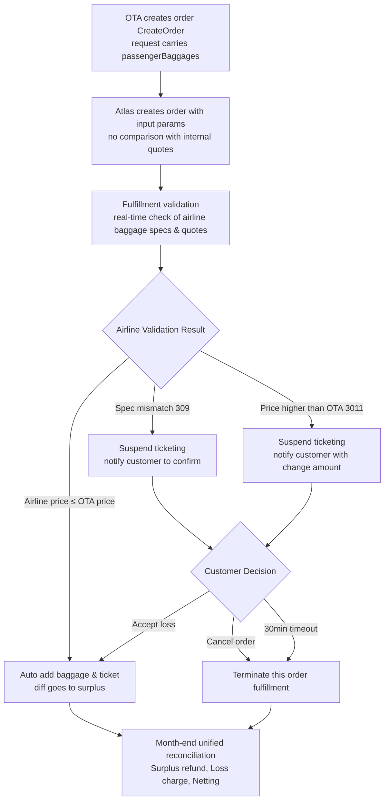
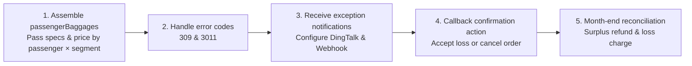

# OTA Baggage Integration



When OTAs sell baggage alongside ticket bookings, Atlas provides an end-to-end capability: "baggage information pass-through → automated fulfillment → exception confirmation → monthly settlement". This enables stable ticketing for OTA-collected baggage orders with unified "surplus refund, deficit charge" settlement at month-end.

### Quick Reference · Key Agreements

<table data-search="false"><thead><tr><th>Item</th><th>Conclusion</th></tr></thead><tbody><tr><td>Price Benchmark</td><td>Use OTA input prices directly for order creation, <strong>no comparison with Atlas internal pricing</strong></td></tr><tr><td>Validation Party</td><td>Airline (returns <code>309</code> / <code>3011</code>)</td></tr><tr><td>Loss Acceptance Timeout</td><td><strong>30 minutes</strong>; unconfirmed orders are automatically canceled after timeout</td></tr><tr><td>Loss Acceptance Callback</td><td>API <code>POST /confirmBaggageLoss.do</code> (pass <code>orderNo</code>) or the ATRIP page</td></tr><tr><td>Order Cancellation</td><td><strong>Reuse existing cancel order interface</strong></td></tr><tr><td>Exception Notification</td><td>DingTalk group notification (existing) + Webhook (existing)</td></tr><tr><td>Settlement</td><td>Unified month-end reconciliation, surplus refund / loss charge, with netting</td></tr></tbody></table>

***

### Problems Solved

| Pain Point                                                                                   | This Solution's Response                                                                                                                   |
| -------------------------------------------------------------------------------------------- | ------------------------------------------------------------------------------------------------------------------------------------------ |
| OTA has already sold baggage to passengers, but baggage specs/prices are OTA-proprietary     | Atlas **does NOT compare/replace with internal baggage quotes**, directly creates orders using OTA-provided specs and prices               |
| Airline actual price at fulfillment differs from OTA selling price, risking loss or disputes | Real-time airline price validation: **profit generates rebate, loss requires confirmation first**, unified netting settlement at month-end |
| Spec non-compliance with airline requirements causes entire order failure                    | Independent `309` exception notification; confirm first, then handle                                                                       |
| Loss order appeal later requires screenshots                                                 | Clear screenshot responsibility attribution, pre-agreed in process                                                                         |

***

### Core Business Process



***

### Key Business Rules

#### Baggage Info Pass-Through (Order Creation Stage)

When calling the Atlas create order interface (`CreateOrder` / `POST /order.do`), customers pass in baggage already sold by OTA:

* Baggage **type/specs** (weight-based or piece-based, weight, pieces, checked/carry-on).
* OTA-side **sales amount and currency**.
* Baggage **passenger**.
* Baggage **flight segment** (linked by flight number).


**Important:** Atlas **does not compare or match its own quotes**. It directly creates orders using customer input parameters.


#### Automated Fulfillment Rules

During fulfillment, the system validates real-time purchasable baggage specifications and prices from the airline.

* **Airline actual price ≤ OTA selling price:** Automatically complete baggage add-on and ticketing. **The surplus is refunded to the customer as a rebate in the month-end statement.**

#### Exception Handling Rules

During fulfillment, if either condition occurs, the system **suspends automatic ticketing and asks the customer to confirm**:

| Trigger Condition                                                | Error Code | Meaning                                                           |
| ---------------------------------------------------------------- | ---------- | ----------------------------------------------------------------- |
| Customer-provided baggage specs do not meet airline requirements | **309**    | Specifications are not purchasable; the order cannot continue     |
| Airline actual quote is higher than OTA selling price            | **3011**   | Price change (loss risk); notification includes the change amount |

**Notification methods:**

* DingTalk group notification (**already supported**).
* Webhook notification (**already supported**).

**Customer options after receiving notification:**

1. **Cancel Order:** Atlas terminates fulfillment for this order. **Reuse the existing cancel order interface.**
2. **Accept Loss:** After confirmation, Atlas continues baggage fulfillment and ticketing. The resulting loss is combined with the rebate for month-end reconciliation.
   * The system flags these orders for loss acceptance.
   * **The confirmation window is 30 minutes.** **Unconfirmed orders are automatically canceled.**

#### Screenshot Clarification (Voucher Responsibility)

For **loss-accepted orders**, Atlas does not provide airline website screenshots for appeals.

After receiving the **loss order completion notification**, the customer should check the airline website and save screenshots for appeals or internal audits.

#### Month-End Unified Settlement

During month-end reconciliation, Atlas aggregates all OTA baggage add-on orders and calculates:

* **Surplus amount** from baggage add-ons → refund to the customer.
* **Loss amount** from baggage add-ons → charge to the customer.

Final settlement appears in the **month-end statement** on a **netting basis**.

***

### Settlement Example

| Scenario         | OTA Selling Price | Airline Actual Price | Outcome                             | Month-End Settlement      |
| ---------------- | ----------------- | -------------------- | ----------------------------------- | ------------------------- |
| Surplus          | 30 USD            | 25 USD               | Auto ticketing                      | Refund customer **5 USD** |
| Loss (confirmed) | 30 USD            | 35 USD               | Customer accepts loss, then tickets | Charge customer **5 USD** |

***

### FAQ

#### Basic understanding

**Q1. What is "baggage add-on with order"?**

It refers to a passenger purchasing baggage during an OTA flight booking. The merchant passes the baggage order with the ticket order to Atlas for fulfillment and ticketing.

**Q2. Will Atlas replace OTA-provided baggage with its own internal baggage product?**

**No.** This solution does not compare Atlas quotes. It creates orders from the customer's specifications and prices.

**Q3. Will Atlas perform local pre-validation on the provided baggage price and specifications?**

There is **no local pre-validation**. The airline response is authoritative.

**Q4. Is this capability mandatory?**

It is **optional**. Without `passengerBaggages`, the order follows the normal booking flow. The OTA baggage flow starts only when the field is populated.

***

#### Pricing and settlement

**Q5. Who determines the baggage price?**

The price uses the **OTA-provided selling price** (`bookSalePrice`). The airline price is compared during fulfillment.

**Q6. If the airline price is lower than the OTA selling price, who gets the difference?**

The customer receives it. The **surplus is refunded as a rebate in the month-end statement**.

**Q7. What happens if the airline price is higher than the OTA selling price?**

The system **suspends automatic ticketing and notifies the customer** (error code `3011`). The notification includes the change amount. The customer can cancel the order or accept the loss within the time limit. **The accepted-loss amount is charged at month-end.**

**Q8. How are surplus and loss settled?**

**Month-end reconciliation** reflects the surplus refund and loss charge together on a **netting basis**.

**Q9. Can you provide a settlement example?**

* The OTA sells for 30 USD. The airline charges 25 USD. The 5 USD surplus is refunded at month-end.
* The OTA sells for 30 USD. The airline charges 35 USD. After acceptance and ticketing, 5 USD is charged at month-end.

***

#### Exception handling and confirmation

**Q10. What types of exceptions may occur?**

Two main types:

* `309`: Baggage **specifications** do not meet airline requirements. The order cannot continue.
* `3011`: The airline quote is **higher than** the OTA price (price-change or loss risk).

**Q11. How are exceptions notified to the customer?**

* **DingTalk group notification**.
* **Webhook notification**.

**Q12. After receiving an exception notification, what can the customer do?**

* **Cancel Order:** Atlas terminates fulfillment for the order.
* **Accept Loss:** Continue ticketing and settle the loss at month-end. The system flags these orders. Confirm through `confirmBaggageLoss.do` with `orderNo`, or in ATRIP.

**Q13. Is there a time limit for "loss acceptance"?**

**Yes. The confirmation window is 30 minutes.** After 30 minutes, **the order is automatically canceled**.

**Q14. What if the customer neither cancels nor confirms?**

**After 30 minutes without confirmation, the order is automatically canceled.**

**Q15. Can specification-mismatch (`309`) orders continue through "loss acceptance"?**

`309` means the **specifications are not purchasable**. It is a hard block. **Loss acceptance cannot bypass it.** The customer must cancel or adjust the request and create a new order.

***

#### Specifications and matching

**Q16. How do I pass weight-based versus piece-based baggage?**

* **Weight-based** (unlimited pieces): Set `pkgNumber` to `-1` and provide a positive `weight`.
* **Piece-based:** Set `pkgNumber` to a positive integer, such as `1`, `2`, or `3`. Provide `weight` as required by the airline product.

**Q17. Can `pkgNumber` be `0`?**

Do **not** pass `0`; its meaning is ambiguous. Use `-1` for weight-based baggage and a positive integer for piece-based baggage.

**Q18. How is baggage bound to a passenger and segment?**

* First bind the order passenger by **passenger name** (`passengerName`).
* Then bind the flight segment by **flight number** (`flight`).
* If the name does not match an order passenger, the baggage entry **is not linked**.


**Avoid this scenario:** Do not submit with-order baggage when an order contains multiple segments with the **same flight number**. Atlas cannot distinguish the segments.


**Q19. What if an order contains multiple segments with the same flight number?**

Atlas **matches segments only by flight number**. It cannot use `depTime`, `fromAirport`, or `toAirport` for further differentiation. Avoid submitting baggage for same-flight, multi-segment orders. Otherwise, it may link the wrong segment.

**Q20. How do I distinguish checked and carry-on baggage?**

`baggageType`: `0` = checked baggage (default); `1` = carry-on baggage.

**Q21. Should `bookSalePrice` be the entire trip total or a per-segment price?**

Provide the **current segment** price, not the entire trip total.

***

#### Screenshot voucher

**Q22. Will Atlas provide airline website screenshots for loss-order appeals?**

**Atlas does not provide screenshots.** After receiving the **loss order completion notification**, the customer should check the airline website and save screenshots.

**Q23. When should screenshots be taken?**

Take screenshots **after receiving the loss order completion notification**. This confirms the order is generated and visible in the airline system.

***

#### Technical integration

**Q24. What does the customer need to do to integrate?**

See the [technical integration guide](china-ota-baggage-integration.md#technical-integration-guide) for details. In summary:

1. Add `passengerBaggages` to the `POST /order.do` request body.
2. Pass specifications and price for each passenger and segment.
3. Handle error codes `309` and `3011`.
4. Configure DingTalk or a webhook for exception notifications.
5. Implement loss acceptance through `confirmBaggageLoss.do` or ATRIP. Implement order cancellation.

***

### Technical integration guide


**Focus:** This section answers, "**What does the customer need to do?**"


#### Prerequisites

| Item         | Description                                                       |
| ------------ | ----------------------------------------------------------------- |
| Interface    | Atlas create order interface `POST /order.do` (`CreateOrder`)     |
| New Field    | Add `passengerBaggages` node in request body                      |
| Field Nature | **Optional**: omitted = normal order; provided = OTA baggage flow |

***

#### Customer task list



| # | Customer Action                                                                                                         | Mandatory                     | Corresponding Section                              |
| - | ----------------------------------------------------------------------------------------------------------------------- | ----------------------------- | -------------------------------------------------- |
| 1 | Assemble `passengerBaggages` in the `CreateOrder` request body. Pass specifications and price by passenger and segment. | Mandatory when baggage exists | Interface and request body / Field quick reference |
| 2 | Identify and handle error codes `309` (specification mismatch) and `3011` (airline price > OTA price).                  | Mandatory                     | Error codes and exception handling                 |
| 3 | Configure DingTalk group notification + Webhook callback URL to receive exception notifications                         | Mandatory                     | §6 Notification & Callback                         |
| 4 | Implement accept-loss and cancel-order callbacks within 30 minutes.                                                     | Mandatory                     | Loss acceptance and cancellation callback          |
| 5 | Complete month-end reconciliation for surplus refunds, loss charges, and netting.                                       | Mandatory                     | Settlement reconciliation                          |

***

#### Interface and request body

* **Interface:** `POST /order.do` (create order)
* **Add-on node location:** Request body root level: `"passengerBaggages": [ ... ]`
* **Data hierarchy:** `passengerBaggages` → `PassengerBaggageReqData` (passenger level) → `baggages` (segment level) → `baggagePrices` (specification and price level)

#### Full Request Example（Main Ticket + Baggage）

```json
{
    "sessionId": "6822e239-0cc7-4134-8956-b1a618fd0dcd",
    "passengers": [
        {
            "name": "zhangsan/zhangsan",
            "passengerType": 0,
            "birthday": "19491001",
            "gender": "M",
            "cardNum": "G88888888",
            "cardType": "PP",
            "cardIssuePlace": "CN",
            "cardExpired": "20251001",
            "nationality": "CN"
        }
    ],
    "passengerBaggages": [
        {
            "passengerName": "zhangsan/zhangsan",
            "baggages": [
                {
                    "cabin": "T",
                    "depTime": "202607200505",
                    "flight": "JT786",
                    "fromAirport": "SUB",
                    "toAirport": "UPG",
                    "baggagePrices": [
                        {
                            "bookSalePrice": 50.00,
                            "bookSaleCurrency": "USD",
                            "pkgNumber": -1,
                            "weight": 20,
                            "baggageType": 0
                        }
                    ]
                },
                {
                    "cabin": "T",
                    "depTime": "202607200910",
                    "flight": "JT742",
                    "fromAirport": "UPG",
                    "toAirport": "MDC",
                    "baggagePrices": [
                        {
                            "bookSalePrice": 60.00,
                            "bookSaleCurrency": "USD",
                            "pkgNumber": -1,
                            "weight": 20,
                            "baggageType": 0
                        }
                    ]
                }
            ]
        }
    ],
    "contact": {
        "name": "ZS",
        "address": "NJ",
        "postcode": "",
        "email": "106@qq.com",
        "mobile": "0065-81234567"
    }
}
```

***

#### Field quick reference

**`PassengerBaggageReqData` (passenger level)**

| Field           | Type   | Integration Requirement           | How to Fill                                                                        |
| --------------- | ------ | --------------------------------- | ---------------------------------------------------------------------------------- |
| `passengerName` | String | **Mandatory** when baggage exists | Must match the order passenger name. No match → baggage is not linked.             |
| `baggages`      | Array  | **Mandatory** when baggage exists | Baggage list for this passenger across segments. An empty array means no purchase. |

**`BaggageReqData` (segment level)**

| Field                                             | Type   | Integration Requirement | How to Fill                                                                                                   |
| ------------------------------------------------- | ------ | ----------------------- | ------------------------------------------------------------------------------------------------------------- |
| `flight`                                          | String | **Mandatory**           | Flight number. It must match the itinerary. **Atlas matches only by flight number.** Non-matches are blocked. |
| `baggagePrices`                                   | Array  | **Mandatory**           | Specifications and selling price for this segment. An empty list means the segment is ignored.                |
| `cabin` / `depTime` / `fromAirport` / `toAirport` | String | Optional                | Used only for compatibility. The OTA flow does **not** use these fields for matching or validation.           |


**Avoid this scenario:** Do not submit with-order baggage when an order contains multiple segments with the **same flight number**. Atlas cannot distinguish the segments.


**`BaggagePriceReqData` (specification and price level)**

| Field              | Type    | Integration Requirement                           | How to Fill                                                                        |
| ------------------ | ------- | ------------------------------------------------- | ---------------------------------------------------------------------------------- |
| `bookSalePrice`    | Decimal | **Recommended**                                   | OTA price for the **current segment**, not the whole trip. Use two decimal places. |
| `bookSaleCurrency` | String  | **Mandatory**                                     | Currency, such as `USD` or `SGD`. Align it with the order currency when possible.  |
| `pkgNumber`        | Integer | Piece-based: positive integer; weight-based: `-1` | Number of pieces. Use `-1` for unlimited pieces. **Do not pass** `0`.              |
| `weight`           | Integer | **Mandatory**                                     | Chargeable baggage **total weight** in kg.                                         |
| `baggageType`      | Integer | Optional                                          | `0` = checked (default); `1` = carry-on.                                           |

***

#### Error codes and exception handling

Customer-provided prices and specifications **do not compare with Atlas internal quotes**. **The airline is the final validator.**

| Error Code | Meaning                                                 | Trigger Outcome                                                          | What Customer Needs to Do                                        |
| ---------- | ------------------------------------------------------- | ------------------------------------------------------------------------ | ---------------------------------------------------------------- |
| **309**    | Baggage specifications do not meet airline requirements | Order cannot continue (**hard block; loss acceptance cannot bypass it**) | Cancel the order or adjust specifications and create a new order |
| **3011**   | Airline price > OTA price                               | Order is **suspended**. The notification includes the change amount.     | Accept the loss or cancel the order **within 30 minutes**        |


**Note:** When the airline price is less than or equal to the OTA selling price, ticketing is automatic. The surplus is refunded at month-end. **No customer action is required.**


***

#### Notification and callback

| Notification Method             | Status                | What Customer Needs to Do                                                                                                 |
| ------------------------------- | --------------------- | ------------------------------------------------------------------------------------------------------------------------- |
| **DingTalk Group Notification** | **Already Supported** | Provide/configure DingTalk group to receive notifications                                                                 |
| **Webhook Notification**        | **Already Supported** | Provide a callback URL. Parse `309` and `3011`, including the change amount, then trigger the internal confirmation flow. |

***

#### Loss acceptance and cancellation callback

Loss acceptance supports **two methods**. Order cancellation reuses the existing cancel-order interface.

**Method 1: API confirmation (recommended for system integrations)**

**Interface:** `POST https://api-sg.atriptech.com/confirmBaggageLoss.do`

**Request headers:**

| Header                  | Description           |
| ----------------------- | --------------------- |
| `x-atlas-client-id`     | Client integration ID |
| `x-atlas-client-secret` | Client secret         |
| `Content-Type`          | `application/json`    |

**Request body:**

| Field     | Description                             |
| --------- | --------------------------------------- |
| `orderNo` | Order number to confirm loss acceptance |

**cURL example:**

```bash
curl --location --request POST 'https://api-sg.atriptech.com/confirmBaggageLoss.do' \
--header 'x-atlas-client-id: asski97439' \
--header 'x-atlas-client-secret: test' \
--header 'Content-Type: application/json' \
--data-raw '{
    "orderNo": "TESTA20260716103853804"
}'
```

**Method 2: ATRIP page confirmation**

Find the flagged loss order in ATRIP. Click **Confirm baggage price change**. The system accepts the price change and starts ticketing.


**Time limit and timeout**

* **Confirmation window:** 30 minutes from the `3011` price-change notification.
* **After 30 minutes without confirmation:** The order is automatically canceled.
* Prepare an internal decision workflow, confirmation-call handling, and a 30-minute countdown.

**Order cancellation**

**Reuse the existing cancel-order interface.** This solution adds no new cancel interface.

***

#### Settlement reconciliation

During month-end reconciliation, Atlas aggregates all orders with baggage:

* Surplus → refund to the customer.
* Loss → charge to the customer.
* Results appear in the month-end statement on a **netting basis**.

**Customer action:** Confirm baggage surplus and loss details in the reconciliation statement.

***

### Related Pages

* [Optional Ancillaries](../../booking/optional-ancillaries/)
* [Fulfilment API](../../booking/booking-flows/fulfillment-flow.md)
* [Fulfilment API FAQ](../../../support-and-reference/troubleshooting-and-support/faqs/fulfilment-api-faq.md)
* [Error Codes](../../../support-and-reference/troubleshooting-and-support/errors-handing/)
