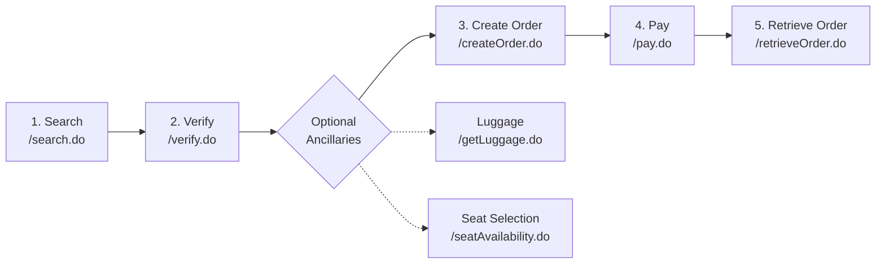
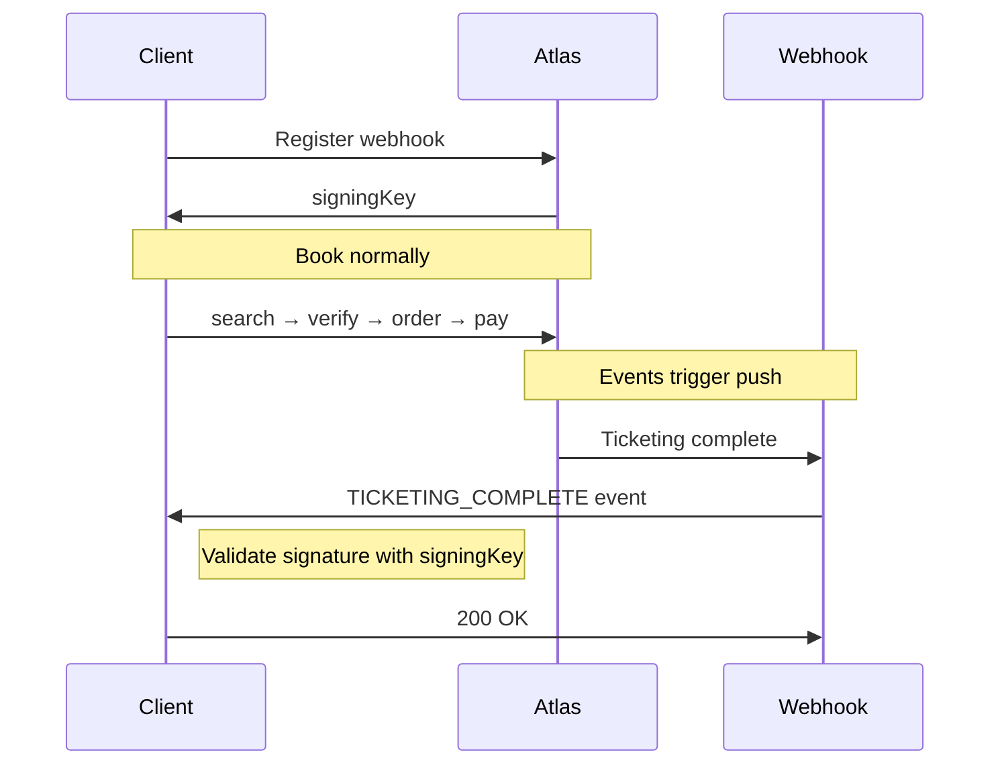

# Atlas API Capability Map



Use this page to understand the full Atlas API landscape: three search entry points, five core business stages, and 26 API endpoints covering search, booking, payment, refunds, rebooking, and ancillary services.

---

## Overview

Atlas API is organized around three search entry points that feed into a common booking pipeline with five core stages.

  

    
3

    
Search entry points

  

  

    
5

    
Core stages

  

  

    
26

    
API endpoints

  

  

    
8

    
Integration paths

  

---

## Search Entry Points

Choose the right search endpoint for your use case:

  

    

    

      
Standard Search

      
POST /search.do

      
Most common use case: one-way/return journeys, airline filtering, flight number targeting, multiple fare classes

    

  

  

    

    

      
Direct Offer

      
POST /getOffers.do

      
Skip search when you already know the exact flight and class you want to book; improves L2B conversion

    

  

  

    

    

      
Smart Search

      
POST /smartSearch.do

      
TMC-only; covers routes and time slots not available via standard Search

    

  

---

## Standard Booking Flow

This is the complete standard booking journey.







### Step 1: Search flights

**Endpoint:** `POST /search.do`

Returns available flight options with a `routingIdentifier` used in subsequent calls.

Capabilities:
* Trip type (one-way / return)
* Passenger counts (adult / child / infant)
* Origin / destination city or airport IATA codes
* Departure / return dates (yyyyMMdd format)
* Airline / flight number filtering (optional)
* Multiple fare classes and currency options

---

### Step 2: Verify price

**Endpoint:** `POST /verify.do`

**Requires:** `routingIdentifier` from search

Validates the current price and returns:
* `sessionId` for booking
* `bookingRequirement` details
* Fare rules and cancellation policies
* Baggage allowance information

---

### Step 3 (Optional): Ancillary selection

Before creating the order, you can retrieve available ancillary options:

| Service | Endpoint | Returns |
|---------|----------|---------|
| Luggage options | `POST /getLuggage.do` | Available baggage tiers and prices |
| Seat selection | `POST /seatAvailability.do` | Seat maps with pricing per category |

Both endpoints require the `sessionId` from verify.

---

### Step 4: Create order

**Endpoint:** `POST /createOrder.do`

**Requires:** `sessionId` from verify

Creates the booking record and accepts:
* Passenger information (names, DOB, documents)
* Contact information (email, phone)
* Internal order reference (for reconciliation)
* Insurance and ancillary selections

Returns an `orderNumber` for payment and subsequent operations.

---

### Step 5: Payment

**Endpoint:** `POST /pay.do`

**Requires:** `orderNumber` from createOrder

Supported payment methods:
* Deposit (prepaid balance)
* VCC (virtual credit card)
* MoR (Merchant of Record) billing
* Credit cards: Visa / MC / AE / Discover

---

### Step 6: Retrieve order

**Endpoint:** `POST /retrieveOrder.do`

**Requires:** `orderNumber`

After successful payment, retrieve order details:
* Booking status and ticketing status
* Ticket numbers
* PNR information
* Passenger details
* Ancillary service status




---

## Booking Flow API Cards

  

    

    

      
Search

      
POST /search.do

      
Entry point (no dependency)

      <ul style="padding-left: 16px; margin-top: 6px;">
        <li style="font-size: 12px; color: #0F172A; line-height: 1.6;">One-way / return trips</li>
        <li style="font-size: 12px; color: #0F172A; line-height: 1.6;">Passenger counts (ADT/CHD/INF)</li>
        <li style="font-size: 12px; color: #0F172A; line-height: 1.6;">Origin/destination IATA codes</li>
        <li style="font-size: 12px; color: #0F172A; line-height: 1.6;">Departure/return dates</li>
        <li style="font-size: 12px; color: #0F172A; line-height: 1.6;">Airline/flight number filters</li>
        <li style="font-size: 12px; color: #0F172A; line-height: 1.6;">Multiple fare classes, currencies</li>
      </ul>
    

  

  

    

    

      
Verify

      
POST /verify.do

      
Requires: search.do routingIdentifier

      <ul style="padding-left: 16px; margin-top: 6px;">
        <li style="font-size: 12px; color: #0F172A; line-height: 1.6;">Real-time price validation</li>
        <li style="font-size: 12px; color: #0F172A; line-height: 1.6;">Returns sessionId for booking</li>
        <li style="font-size: 12px; color: #0F172A; line-height: 1.6;">Returns bookingRequirement</li>
        <li style="font-size: 12px; color: #0F172A; line-height: 1.6;">Fare rules/cancellation policy</li>
        <li style="font-size: 12px; color: #0F172A; line-height: 1.6;">Baggage allowance details</li>
      </ul>
    

  

  

    

    

      
Create Order

      
POST /createOrder.do

      
Requires: verify.do sessionId

      <ul style="padding-left: 16px; margin-top: 6px;">
        <li style="font-size: 12px; color: #0F172A; line-height: 1.6;">Passenger info (names, DOB, docs)</li>
        <li style="font-size: 12px; color: #0F172A; line-height: 1.6;">Contact info (email, phone)</li>
        <li style="font-size: 12px; color: #0F172A; line-height: 1.6;">Internal order reference</li>
        <li style="font-size: 12px; color: #0F172A; line-height: 1.6;">Insurance + ancillary selection</li>
        <li style="font-size: 12px; color: #0F172A; line-height: 1.6;">Returns orderNumber</li>
      </ul>
    

  

  

    

    

      
Pay

      
POST /pay.do

      
Requires: createOrder.do orderNumber

      <ul style="padding-left: 16px; margin-top: 6px;">
        <li style="font-size: 12px; color: #0F172A; line-height: 1.6;">Deposit (prepaid balance)</li>
        <li style="font-size: 12px; color: #0F172A; line-height: 1.6;">VCC (virtual credit card)</li>
        <li style="font-size: 12px; color: #0F172A; line-height: 1.6;">MoR (Merchant of Record)</li>
        <li style="font-size: 12px; color: #0F172A; line-height: 1.6;">Credit cards: Visa/MC/AE/Discover</li>
      </ul>
    

  

  

    

    

      
Retrieve Order

      
POST /retrieveOrder.do

      
Requires: pay.do success

      <ul style="padding-left: 16px; margin-top: 6px;">
        <li style="font-size: 12px; color: #0F172A; line-height: 1.6;">Booking & ticketing status</li>
        <li style="font-size: 12px; color: #0F172A; line-height: 1.6;">Ticket numbers</li>
        <li style="font-size: 12px; color: #0F172A; line-height: 1.6;">PNR information</li>
        <li style="font-size: 12px; color: #0F172A; line-height: 1.6;">Passenger details</li>
        <li style="font-size: 12px; color: #0F172A; line-height: 1.6;">Ancillary service status</li>
      </ul>
    

  

---

## Direct Offer Flow (GetOffer)

Use the GetOffer flow when you already know the exact flight and fare class. This skips the search step and improves conversion.

  

    

    

      
Get Offer

      
POST /getOffers.do

      
No dependency (2nd entry point)

      <ul style="padding-left: 16px; margin-top: 6px;">
        <li style="font-size: 12px; color: #0F172A; line-height: 1.6;">Airline, flight number, class</li>
        <li style="font-size: 12px; color: #0F172A; line-height: 1.6;">Date, origin/destination</li>
        <li style="font-size: 12px; color: #0F172A; line-height: 1.6;">Returns offerId + sessionId</li>
      </ul>
    

  

  

    

    

      
Get Offer Price

      
POST /getOfferPrice.do

      
Requires: getOffers.do offerId

      <ul style="padding-left: 16px; margin-top: 6px;">
        <li style="font-size: 12px; color: #0F172A; line-height: 1.6;">Real-time exact pricing</li>
        <li style="font-size: 12px; color: #0F172A; line-height: 1.6;">For display and comparison</li>
      </ul>
    

  


**Pro tip:** Use GetOffer when rebooking or when users select from cached search results. This reduces API calls and speeds up the booking process.


---

## Smart Search Flow (TMC only)

Smart Search is for TMC partners needing extended coverage.

  

    

    

      
Smart Search

      
POST /smartSearch.do

      
Requires: TMC account permissions

      <ul style="padding-left: 16px; margin-top: 6px;">
        <li style="font-size: 12px; color: #0F172A; line-height: 1.6;">Extended route coverage</li>
        <li style="font-size: 12px; color: #0F172A; line-height: 1.6;">Extended time slot coverage</li>
        <li style="font-size: 12px; color: #0F172A; line-height: 1.6;">Returns routingIdentifier</li>
      </ul>
    

  

  

    

    

      
Price Compare Search

      
POST /priceCompareSearch.do

      
Optional - comparison only

      <ul style="padding-left: 16px; margin-top: 6px;">
        <li style="font-size: 12px; color: #0F172A; line-height: 1.6;">Multi-flight comparison</li>
        <li style="font-size: 12px; color: #0F172A; line-height: 1.6;">Flexible date comparison</li>
        <li style="font-size: 12px; color: #0F172A; line-height: 1.6;">Price calendar view</li>
      </ul>
    

  


SmartSearch covers routes and time slots not available via the standard Search endpoint. Contact your account manager to enable TMC-specific features.


---

## Post-ticketing Operations

After ticketing, these operations are available:

  

    

    

      
Refund

      
POST /refund.do

      
Requires: ticketed order

      <ul style="padding-left: 16px; margin-top: 6px;">
        <li style="font-size: 12px; color: #0F172A; line-height: 1.6;">Partial or full refunds</li>
        <li style="font-size: 12px; color: #0F172A; line-height: 1.6;">Voluntary or involuntary</li>
        <li style="font-size: 12px; color: #0F172A; line-height: 1.6;">Refund amount calculation</li>
        <li style="font-size: 12px; color: #0F172A; line-height: 1.6;">Status tracking</li>
      </ul>
    

  

  

    

    

      
Regenerate Order

      
POST /regenerateOrder.do

      
Requires: ticketed order

      <ul style="padding-left: 16px; margin-top: 6px;">
        <li style="font-size: 12px; color: #0F172A; line-height: 1.6;">Order regeneration</li>
        <li style="font-size: 12px; color: #0F172A; line-height: 1.6;">Rebook scenario support</li>
        <li style="font-size: 12px; color: #0F172A; line-height: 1.6;">Preserves original order info</li>
      </ul>
    

  

  

    

    

      
Stop Ticketing

      
POST /stopTicketIssuance.do

      
Requires: paid, not ticketed

      <ul style="padding-left: 16px; margin-top: 6px;">
        <li style="font-size: 12px; color: #0F172A; line-height: 1.6;">Emergency stop before ticketing</li>
        <li style="font-size: 12px; color: #0F172A; line-height: 1.6;">Post-payment rapid response</li>
      </ul>
    

  

---

## Ancillary Services

Additional services that can be added pre or post booking:

  

    

    

      
Luggage

      
POST /getLuggage.do

      
Timing: After verify, before createOrder

      <ul style="padding-left: 16px; margin-top: 6px;">
        <li style="font-size: 12px; color: #0F172A; line-height: 1.6;">Baggage tier options</li>
        <li style="font-size: 12px; color: #0F172A; line-height: 1.6;">Per-category pricing</li>
      </ul>
    

  

  

    

    

      
Seat Selection

      
POST /seatAvailability.do

      
Timing: After verify, before createOrder

      <ul style="padding-left: 16px; margin-top: 6px;">
        <li style="font-size: 12px; color: #0F172A; line-height: 1.6;">Interactive seat maps</li>
        <li style="font-size: 12px; color: #0F172A; line-height: 1.6;">Category-based pricing</li>
      </ul>
    

  

  

    

    

      
Post-ticketing Ancillaries

      
POST /bookAncillary.do

      
Timing: After ticketing

      <ul style="padding-left: 16px; margin-top: 6px;">
        <li style="font-size: 12px; color: #0F172A; line-height: 1.6;">Add luggage post-ticketing</li>
        <li style="font-size: 12px; color: #0F172A; line-height: 1.6;">Select seats post-ticketing</li>
        <li style="font-size: 12px; color: #0F172A; line-height: 1.6;">Separate ancillary payment</li>
      </ul>
    

  

---

## Webhook Notifications

Atlas can push event notifications to your system via webhooks.

### Event Types

  

    
TICKETING_COMPLETE

    
Ticketing completed successfully

  

  

    
VOID_NOTIFICATION

    
Order voided

  

  

    
SCHEDULE_CHANGE

    
Flight schedule changed

  

  

    
AIRLINE_STATUS_UPDATE

    
Airline status update

  

  

    
EMAIL_NOTIFICATION

    
Email notification sent

  

  

    
INCIDENT_NOTIFICATION

    
Incident event

  

### Registration & Query

---

## Order Management & PNR

  

    

    

      
Order List

      
POST /orderList.do

      <ul style="padding-left: 16px; margin-top: 6px;">
        <li style="font-size: 12px; color: #0F172A; line-height: 1.6;">Filter by date range</li>
        <li style="font-size: 12px; color: #0F172A; line-height: 1.6;">Filter by status</li>
        <li style="font-size: 12px; color: #0F172A; line-height: 1.6;">Pagination support</li>
      </ul>
    

  

  

    

    

      
Extract PNR

      
POST /extractPnr.do

      <ul style="padding-left: 16px; margin-top: 6px;">
        <li style="font-size: 12px; color: #0F172A; line-height: 1.6;">Raw PNR content</li>
        <li style="font-size: 12px; color: #0F172A; line-height: 1.6;">E-ticket information</li>
      </ul>
    

  

  

    

    

      
PNR Claim

      
POST /pnrClaim.do

      <ul style="padding-left: 16px; margin-top: 6px;">
        <li style="font-size: 12px; color: #0F172A; line-height: 1.6;">Claim PNR ownership</li>
        <li style="font-size: 12px; color: #0F172A; line-height: 1.6;">Bind to order reference</li>
      </ul>
    

  

---

## Utility Endpoints

  

    

    

      
Balance

      
POST /balance.do

      <ul style="padding-left: 16px; margin-top: 6px;">
        <li style="font-size: 12px; color: #0F172A; line-height: 1.6;">Account balance check</li>
        <li style="font-size: 12px; color: #0F172A; line-height: 1.6;">Multi-currency support</li>
      </ul>
    

  

  

    

    

      
Flight Data Feed

      
POST /flightDataFeed.do

      <ul style="padding-left: 16px; margin-top: 6px;">
        <li style="font-size: 12px; color: #0F172A; line-height: 1.6;">Full route data export</li>
        <li style="font-size: 12px; color: #0F172A; line-height: 1.6;">Incremental sync</li>
      </ul>
    

  

  

    

    

      
Email Query

      
POST /emailQuery.do

      <ul style="padding-left: 16px; margin-top: 6px;">
        <li style="font-size: 12px; color: #0F172A; line-height: 1.6;">Email content lookup</li>
        <li style="font-size: 12px; color: #0F172A; line-height: 1.6;">Attachment downloads</li>
      </ul>
    

  

  

    

    

      
aTrip Token

      
POST /atripToken.do

      <ul style="padding-left: 16px; margin-top: 6px;">
        <li style="font-size: 12px; color: #0F172A; line-height: 1.6;">Obtain access tokens</li>
        <li style="font-size: 12px; color: #0F172A; line-height: 1.6;">Token refresh mechanism</li>
      </ul>
    

  

---

## API Dependency Reference

This table shows the key parameter flows between endpoints:

| API | Depends on | Key parameters passed |
|-----|-----------|----------------------|
| `search.do` | - | `routingIdentifier` → Verify |
| `verify.do` | `search.do` | `sessionId` → CreateOrder / rules / baggage |
| `createOrder.do` | `verify.do` / `getOffers.do` | `sessionId`, `bookingRequirement` |
| `getOffers.do` | - | `offerId`, `sessionId` |
| `pay.do` | `createOrder.do` | `orderNumber` |
| `refund.do` | `retrieveOrder.do` | `orderNumber`, `ticketNumber` |
| `getLuggage.do` | `verify.do` | `sessionId` |
| `seatAvailability.do` | `verify.do` | `sessionId` |
| `bookAncillary.do` | `retrieveOrder.do` | `orderNumber` |
| `regenerateOrder.do` | `retrieveOrder.do` | `orderNumber` |

---

### Key Takeaways

* **Entry points:** `search.do`, `getOffers.do`, `smartSearch.do`
* **Mandatory flow:** Search/GetOffer → Verify → CreateOrder → Pay → RetrieveOrder
* **Optional steps:** Luggage / Seat / Ancillary
* **Post-ticketing:** Refund / Regenerate / BookAncillary / OrderList
* **Notifications:** Webhook registration + event consumption

### Related Sections

* [Booking Overview](../product-guides/booking/booking-overview/) - Choose the right booking flow
* [API Reference](../api-reference/) - Complete endpoint specifications
* [Webhook Overview](../product-guides/extensions-and-integrations/webhook-overview/) - Notification setup and handling
