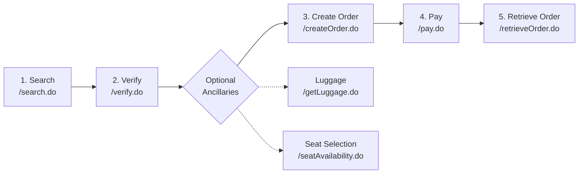
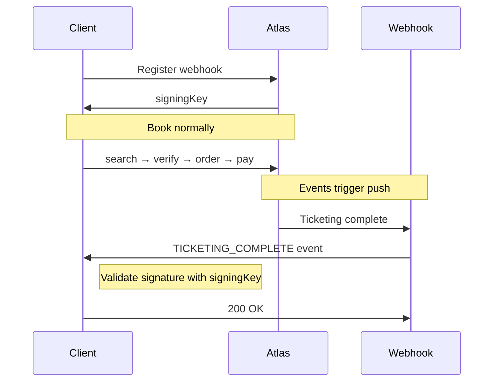

# Atlas API Capability Map



Use this page to understand the full Atlas API landscape: three search entry points, five core business stages, and 26 API endpoints covering search, booking, payment, refunds, rebooking, and ancillary services.

---

## Overview

Atlas API is organized around three search entry points that feed into a common booking pipeline with five core stages.

| Metric | Count | Description |
|--------|-------|-------------|
| Search entry points | 3 | Search, GetOffer, SmartSearch |
| Core stages | 5 | Search → Verify → Book → Pay → Post-ticketing |
| API endpoints | 26 | Full capability coverage |
| Integration paths | 8 | Different flow combinations |

---

## Search Entry Points

Choose the right search endpoint for your use case:

| Entry point | Endpoint | Best for |
|------------|----------|----------|
| **Standard Search** | `POST /search.do` | Most common use case: one-way/return journeys, airline filtering, flight number targeting, multiple fare classes |
| **Direct Offer** | `POST /getOffers.do` | Skip search when you already know the exact flight and class you want to book; improves L2B conversion |
| **Smart Search** | `POST /smartSearch.do` | TMC-only; covers routes and time slots not available via standard Search |

---

## Standard Booking Flow

This is the complete standard booking journey.







### Step 1: Search flights

**Endpoint:** `POST /search.do`

Returns available flight options with a `routingIdentifier` used in subsequent calls.

Capabilities:
* Trip type (one-way / return)
* Passenger counts (adult / child / infant)
* Origin / destination city or airport IATA codes
* Departure / return dates (yyyyMMdd format)
* Airline / flight number filtering (optional)
* Multiple fare classes and currency options

---

### Step 2: Verify price

**Endpoint:** `POST /verify.do`

**Requires:** `routingIdentifier` from search

Validates the current price and returns:
* `sessionId` for booking
* `bookingRequirement` details
* Fare rules and cancellation policies
* Baggage allowance information

---

### Step 3 (Optional): Ancillary selection

Before creating the order, you can retrieve available ancillary options:

| Service | Endpoint | Returns |
|---------|----------|---------|
| Luggage options | `POST /getLuggage.do` | Available baggage tiers and prices |
| Seat selection | `POST /seatAvailability.do` | Seat maps with pricing per category |

Both endpoints require the `sessionId` from verify.

---

### Step 4: Create order

**Endpoint:** `POST /createOrder.do`

**Requires:** `sessionId` from verify

Creates the booking record and accepts:
* Passenger information (names, DOB, documents)
* Contact information (email, phone)
* Internal order reference (for reconciliation)
* Insurance and ancillary selections

Returns an `orderNumber` for payment and subsequent operations.

---

### Step 5: Payment

**Endpoint:** `POST /pay.do`

**Requires:** `orderNumber` from createOrder

Supported payment methods:
* Deposit (prepaid balance)
* VCC (virtual credit card)
* MoR (Merchant of Record) billing
* Credit cards: Visa / MC / AE / Discover

---

### Step 6: Retrieve order

**Endpoint:** `POST /retrieveOrder.do`

**Requires:** `orderNumber`

After successful payment, retrieve order details:
* Booking status and ticketing status
* Ticket numbers
* PNR information
* Passenger details
* Ancillary service status




---

## Direct Offer Flow (GetOffer)

Use the GetOffer flow when you already know the exact flight and fare class. This skips the search step and improves conversion.

| Step | Endpoint | Input | Output |
|------|----------|-------|--------|
| 1. Get Offer | `POST /getOffers.do` | Airline, flight number, class, date, route | `offerId` + `sessionId` |
| 2. Get Offer Price | `POST /getOfferPrice.do` | `offerId` | Real-time exact pricing |
| 3. Create Order | `POST /createOrder.do` | `sessionId` + passenger info | `orderNumber` |


**Pro tip:** Use GetOffer when rebooking or when users select from cached search results. This reduces API calls and speeds up the booking process.


---

## Smart Search Flow (TMC only)

Smart Search is for TMC partners needing extended coverage.

| Step | Endpoint | Requirements |
|------|----------|-------------|
| 1. Smart Search | `POST /smartSearch.do` | TMC account permissions |
| 2. Price Compare Search | `POST /priceCompareSearch.do` | Optional — for multi-flight comparison |


SmartSearch covers routes and time slots not available via the standard Search endpoint. Contact your account manager to enable TMC-specific features.


---

## Post-ticketing Operations

After ticketing, these operations are available:

| Operation | Endpoint | Prerequisite | Use case |
|-----------|----------|-------------|----------|
| **Refund** | `POST /refund.do` | Ticketed order | Partial or full refunds; voluntary or involuntary |
| **Regenerate Order** | `POST /regenerateOrder.do` | Ticketed order | Rebooking scenarios; preserves original order information |
| **Stop Ticketing** | `POST /stopTicketIssuance.do` | Paid, not yet ticketed | Emergency stop before ticketing completes |

---

## Ancillary Services

Additional services that can be added pre or post booking:

| Service | Endpoint | Timing |
|---------|----------|--------|
| Luggage | `POST /getLuggage.do` | After verify, before createOrder |
| Seat selection | `POST /seatAvailability.do` | After verify, before createOrder |
| Post-ticketing ancillaries | `POST /bookAncillary.do` | After ticketing |

---

## Webhook Notifications

Atlas can push event notifications to your system via webhooks.

### Event Types

| Event Code | Description |
|------------|-------------|
| `TICKETING_COMPLETE` | Ticketing completed successfully |
| `VOID_NOTIFICATION` | Order voided |
| `SCHEDULE_CHANGE` | Flight schedule changed |
| `AIRLINE_STATUS_UPDATE` | Airline status update |
| `EMAIL_NOTIFICATION` | Email notification sent |
| `INCIDENT_NOTIFICATION` | Incident event |

### Registration & Query

| Operation | Endpoint | Purpose |
|-----------|----------|---------|
| Register webhook | `POST /webhook/register.do` | Register callback URL and select event types; returns signing key for validation |
| Query incidents | `POST /incident/query.do` | Look up historical events by time range |

---

## Order Management & PNR

| Operation | Endpoint | Capabilities |
|-----------|----------|-------------|
| **Order List** | `POST /orderList.do` | Filter by creation date range or status; pagination support |
| **Extract PNR** | `POST /extractPnr.do` | Retrieve raw PNR and e-ticket information |
| **PNR Claim** | `POST /pnrClaim.do` | Claim PNR ownership and bind to order |

---

## Utility Endpoints

| Tool | Endpoint | Capabilities |
|------|----------|-------------|
| **Balance** | `POST /balance.do` | Check account balance with multi-currency support |
| **Flight Data Feed** | `POST /flightDataFeed.do` | Full route data exports and incremental sync |
| **Email Query** | `POST /emailQuery.do` | Email content lookup and attachment downloads |
| **aTrip Token** | `POST /atripToken.do` | Obtain and refresh access tokens |

---

## API Dependency Reference

This table shows the key parameter flows between endpoints:

| API | Depends on | Key parameters passed |
|-----|-----------|----------------------|
| `search.do` | - | `routingIdentifier` → Verify |
| `verify.do` | `search.do` | `sessionId` → CreateOrder / rules / baggage |
| `createOrder.do` | `verify.do` / `getOffers.do` | `sessionId`, `bookingRequirement` |
| `getOffers.do` | - | `offerId`, `sessionId` |
| `pay.do` | `createOrder.do` | `orderNumber` |
| `refund.do` | `retrieveOrder.do` | `orderNumber`, `ticketNumber` |
| `getLuggage.do` | `verify.do` | `sessionId` |
| `seatAvailability.do` | `verify.do` | `sessionId` |
| `bookAncillary.do` | `retrieveOrder.do` | `orderNumber` |
| `regenerateOrder.do` | `retrieveOrder.do` | `orderNumber` |

---

### Key Takeaways

* **Entry points:** `search.do`, `getOffers.do`, `smartSearch.do`
* **Mandatory flow:** Search/GetOffer → Verify → CreateOrder → Pay → RetrieveOrder
* **Optional steps:** Luggage / Seat / Ancillary
* **Post-ticketing:** Refund / Regenerate / BookAncillary / OrderList
* **Notifications:** Webhook registration + event consumption

### Related Sections

* [Booking Overview](../product-guides/booking/booking-overview/) - Choose the right booking flow
* [API Reference](../api-reference/) - Complete endpoint specifications
* [Webhook Overview](../product-guides/extensions-and-integrations/webhook-overview/) - Notification setup and handling
