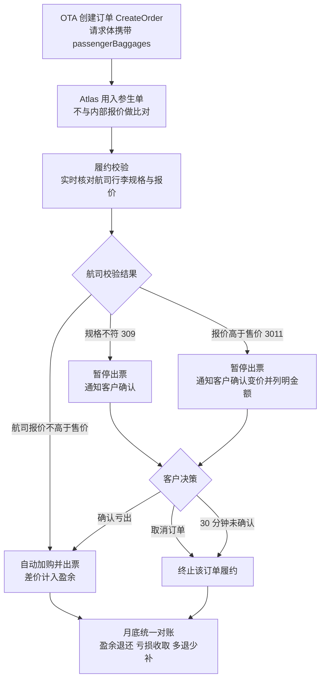
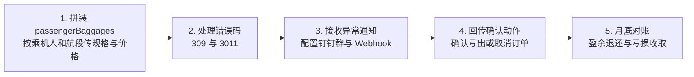

# OTA 随单行李加购



针对 OTA 在下单过程中随单销售行李的场景，Atlas 提供一套"行李信息透传 → 自动履约 → 异常确认 → 月底统一结算"的端到端能力，让 OTA 收单的行李订单可以稳定出票，并在月底按"多退少补"统一结算。

### 速查 · 关键约定

| 事项     | 结论                                                            |
| ------ | ------------------------------------------------------------- |
| 价格基准   | 直接用 OTA 入参价格生单，**不与 Atlas 内部报价比对**                            |
| 校验方    | 航司（返回 `309` / `3011`）                                         |
| 确认亏出时限 | **30 分钟**，超时未确认订单自动取消                                         |
| 确认亏出回传 | ① API `POST /confirmBaggageLoss.do`（传 `orderNo`）；② atrip 页面点击 |
| 取消订单   | **复用现有取消订单接口**                                                |
| 异常通知   | 钉钉群通知（已有）+ Webhook（已有）                                        |
| 结算     | 月底统一对账，盈余退还 / 亏损收取，多退少补                                       |

***

### 解决什么问题

| 痛点                               | 本方案的应对                                          |
| -------------------------------- | ----------------------------------------------- |
| OTA 已向旅客卖出行李，但行李规格 / 价格是 OTA 自有的 | Atlas **不与自身内部行李报价做比对 / 替换**，直接用 OTA 传入的规格与价格生单 |
| 履约时航司实际报价与 OTA 售价不一致，容易亏出或扯皮     | 实时校验航司报价：**赚了返利，亏了先确认再出**，月底统一轧差结算              |
| 规格不符合航司要求导致整单失败                  | 单独抛 `309` 异常通知，先确认再处理                           |
| 亏出订单后续申诉需要凭证                     | 明确截图责任归属，流程前置约定                                 |

***

### 核心业务流程



***

### 关键业务规则

#### 行李信息传递（生单环节）

客户在调用 Atlas 创建订单接口（`CreateOrder` / `POST /order.do`）时，将 OTA 侧已销售的行李信息随单传入：

* 行李 **类型 / 规格**（计重或计件、重量、件数、托运 / 手提）；
* OTA 侧 **销售金额与币种**；
* 行李所属 **乘机人**；
* 行李所属 **航段**（按航班号关联）。


**重要**：Atlas **不做与自身报价的比较和 Match**，直接使用客户入参生单。


#### 自动履约规则

履约过程中，系统实时校验航司侧实际可购买的行李规格与报价：

* **航司实际报价 ≤ OTA 售价**：自动完成行李加购与出票，**差价盈余在月底对账单中以返利形式退还客户**。

#### 异常处理规则

履约中发现以下任一情况，系统 **暂停自动出票并通知客户确认**：

| 触发条件              | 错误码      | 含义                 |
| ----------------- | -------- | ------------------ |
| 客户传入的行李规格不符合航司要求  | **309**  | 规格不可购买，订单无法继续确认通过  |
| 航司侧实际报价高于 OTA 侧报价 | **3011** | 变价（亏出风险），通知中列明变价金额 |

**通知方式**：

* 钉钉群通知（**已支持**）；
* Webhook 通知（**已支持**）。

**客户在收到通知后的可选动作**：

1. **取消订单**：Atlas 终止该订单的履约流程（**复用现有取消订单接口**）。
2. **确认亏出**：客户确认后，Atlas 继续自动完成行李加购及出票；由此产生的亏损金额在月底对账时与返利金额合并计算。
   * 系统会为这类订单打标，打标订单支持客户"**确认亏出**"，系统自动接受变价出票。
   * **确认窗口为 30 分钟**，**超过 30 分钟未确认，订单自动取消**。

#### 截图说明（凭证责任）

对于 **确认亏出** 的订单，若 OTA 后续申诉需要航司官网截图，**Atlas 不提供相关截图**。

客户应在收到亏出订单 **完成通知后**，自行前往航司官网查询订单并截图留存，以便后续申诉或内部核查。

#### 月底统一结算

月底对账时，Atlas 统计所有 OTA 随单行李加购订单，并统一计算：

* 行李加购产生的 **盈余金额 → 退还客户**；
* 行李加购产生的 **亏损金额 → 向客户收取**；

最终结算在 **月底对账单** 中体现，按 **多退少补** 原则完成。

***

### 结算示例

| 场景      | OTA 售价 | 航司实际价  | 结果        | 月底结算            |
| ------- | ------ | ------ | --------- | --------------- |
| 盈余      | 30 USD | 25 USD | 自动出票      | 返还客户 **5 USD**  |
| 亏出（已确认） | 30 USD | 35 USD | 客户确认亏出后出票 | 向客户收取 **5 USD** |

***

### FAQ

#### 基础认知

#### Q1. 什么是"随单行李加购"？

指旅客在中国 OTA **下单机票的过程中**，使用 OTA 自有的行李规格 / 价格购买行李产品的场景；商家将行李订单随机票单一起传给 Atlas，由 Atlas 完成履约出票。

#### Q2. Atlas 会用自己内部的行李产品替换 OTA 传入的行李吗？

**不会**。本方案明确不做与 Atlas 报价的比较和 Match，**直接使用客户入参的规格和价格生单**。

#### Q3. 传入的行李价格和规格，Atlas 会在本地做预校验吗？

**不会本地预校验**，以航司返回为准。航司是最终校验方。

#### Q4. 这个能力是必传的吗？

**可选**。不传 `passengerBaggages` 字段时，按普通订单流程处理；传入时才走 OTA 随单行李链路。

#### 价格与结算

#### Q5. 行李价格由谁决定？

价格以 **OTA 传入的售价（**`bookSalePrice`）为准。履约时再以航司实际报价做比对。

#### Q6. 如果航司实际报价 **低于** OTA 售价，差价归谁？

归客户。差价 **盈余在月底对账单中以返利形式退还**。

#### Q7. 如果航司实际报价 **高于** OTA 售价，会怎样？

系统 **暂停自动出票并通知客户**（错误码 `3011`），通知中会列明变价金额。客户可选择取消订单，或在限时内"确认亏出"继续出票。**确认亏出产生的差额，在月底向客户收取**。

#### Q8. 盈余和亏损怎么结算？

**月底统一对账**，盈余退还、亏损收取，按 **多退少补** 原则在月底对账单中一并轧差体现。

#### Q9. 能否给一个结算例子？

* OTA 售 30 USD，航司实付 25 USD → 盈余 5 USD，月底返还客户。
* OTA 售 30 USD，航司实付 35 USD → 客户确认亏出后出票，月底向客户收取 5 USD。

#### 异常处理与确认

#### Q10. 会遇到哪几类异常？

主要有两类：

* `309`：行李 **规格** 不符合航司要求，订单不能继续确认通过；
* `3011`：航司报价 **高于** OTA 报价（变价 / 亏出风险）。

#### Q11. 异常如何通知到客户？

* **钉钉群通知**；
* **Webhook 通知**。

#### Q12. 收到异常通知后，客户可以做什么？

* **取消订单**：Atlas 终止该订单履约；
* **确认亏出**：继续出票，亏损月底结算。系统会为这类订单打标；**确认方式有两种**：① 调用 API（`confirmBaggageLoss.do`，传 `orderNo`）；② 在 atrip 页面点击确认（详见“确认亏出 / 取消的回传”）。

#### Q13. "确认亏出"有时限吗？

**有，确认窗口为 30 分钟**。超过 30 分钟未确认，**订单将自动取消**。

#### Q14. 如果客户既不取消也不确认，会怎样？

**超过 30 分钟未确认，订单将自动取消**。

#### Q15. 规格不符（309）也能"确认亏出"继续吗？

`309` 是 **规格不可购买**，属于硬性拦截，**无法通过"确认亏出"绕过**，需客户取消或调整后重新下单。

#### 规格与匹配

#### Q16. 计重制和计件制怎么传？

* **计重制**（不限件数）：`pkgNumber: -1`，并填正数 `weight`；
* **计件制**：`pkgNumber` 传正整数（1、2、3…），并按航司产品要求填 `weight`。

#### Q17. `pkgNumber` 可以传 0 吗？

**不建议传 0**（语义不明确）。计重制统一用 `-1`，计件制用正整数。

#### Q18. 行李是怎么绑定到乘机人和航段的？

* 先按 **乘机人姓名**（`passengerName`）绑定到订单乘机人；
* 再按 **航班号**（`flight`）绑定到航段。
* 姓名未匹配到订单乘机人时，该条行李 **不会关联到任何乘机人**。


⚠️ **避免场景**：一个订单内含 **相同航班号** 的多个航段时，不要提交随单行李（无法区分航段）。


#### Q19. 一个订单里如果有 **相同航班号** 的多个航段怎么办？

当前 **仅以航班号匹配航段**，`depTime`、`fromAirport`、`toAirport` 不能用于进一步区分。**应避免在同单含相同航班号多航段的场景下提交随单行李**，否则可能关联错航段。

#### Q20. 托运和手提怎么区分？

`baggageType`：`0` = 托运（默认），`1` = 手提行李。

#### Q21. `bookSalePrice` 填整个行程的总价还是单航段价？

填 **当前航段** 的价格，不是整个行程总价。

#### 截图凭证

#### Q22. 亏出订单需要航司官网截图申诉，Atlas 会提供截图吗？

**Atlas 不提供截图**。客户应在收到亏出订单 **完成通知后**，自行前往航司官网查询订单并截图留存。

#### Q23. 截图应该在什么时间点去取？

在收到 **亏出订单完成通知后** 再取，确保订单已在航司侧生成可见。

#### 技术接入相关

#### Q24. 我们（客户）需要做什么才能接入？

详见“技术接入说明”。简要来说：

1. 在创建订单接口（`POST /order.do`）请求体中加入 `passengerBaggages` 字段；
2. 按乘机人 × 航段传规格与价格；
3. 处理错误码 `309` / `3011`；
4. 配置钉钉群 / Webhook 接收异常通知；
5. 实现"确认亏出"回传（调 `confirmBaggageLoss.do` 或在 atrip 页面点击）及"取消订单"操作。

### 技术接入说明


**本部分重点**：回答"**客户需要做什么**"。


#### 接入前置条件

| 项    | 说明                                           |
| ---- | -------------------------------------------- |
| 接口   | Atlas 创建订单接口 `POST /order.do`（`CreateOrder`） |
| 新增字段 | 在请求体中增加 `passengerBaggages` 节点               |
| 字段性质 | **可选**：不传 = 普通订单；传入 = 走 OTA 随单行李链路           |

#### 客户需要做的事（总览清单）



| # | 客户动作                                                        | 是否必须   | 对应章节           |
| - | ----------------------------------------------------------- | ------ | -------------- |
| 1 | 在 `CreateOrder` 请求体中拼装 `passengerBaggages`，按乘机人 × 航段传入规格与价格 | 有行李时必须 | 接口与请求体 / 字段速查表 |
| 2 | 识别并处理错误码 `309`（规格不符）与 `3011`（航司报价高于 OTA 售价）                 | 必须     | 错误码与异常处理       |
| 3 | 配置钉钉群通知 + Webhook 回调地址接收异常通知                                | 必须     | 通知与回调          |
| 4 | 实现"确认亏出 / 取消订单"的回传操作，并在 30 分钟内完成                            | 必须     | 确认亏出 / 取消的回传   |
| 5 | 配合月底对账结算（盈余退还、亏损收取，多退少补）                                    | 必须     | 结算对账           |

#### 接口与请求体

* **接口**：`POST /order.do`（创建订单）
* **加购节点位置**：请求体根级 `"passengerBaggages": [ ... ]`
* **数据层级**：`passengerBaggages` → `PassengerBaggageReqData`（乘机人）→ `baggages`（航段）→ `baggagePrices`（规格 + 价格）

#### 完整请求示例（含机票主单 + 行李）

```json
{
    "sessionId": "6822e239-0cc7-4134-8956-b1a618fd0dcd",
    "passengers": [
        {
            "name": "zhangsan/zhangsan",
            "passengerType": 0,
            "birthday": "19491001",
            "gender": "M",
            "cardNum": "G88888888",
            "cardType": "PP",
            "cardIssuePlace": "CN",
            "cardExpired": "20251001",
            "nationality": "CN"
        }
    ],
    "passengerBaggages": [
        {
            "passengerName": "zhangsan/zhangsan",
            "baggages": [
                {
                    "cabin": "T",
                    "depTime": "202607200505",
                    "flight": "JT786",
                    "fromAirport": "SUB",
                    "toAirport": "UPG",
                    "baggagePrices": [
                        {
                            "bookSalePrice": 50.00,
                            "bookSaleCurrency": "USD",
                            "pkgNumber": -1,
                            "weight": 20,
                            "baggageType": 0
                        }
                    ]
                },
                {
                    "cabin": "T",
                    "depTime": "202607200910",
                    "flight": "JT742",
                    "fromAirport": "UPG",
                    "toAirport": "MDC",
                    "baggagePrices": [
                        {
                            "bookSalePrice": 60.00,
                            "bookSaleCurrency": "USD",
                            "pkgNumber": -1,
                            "weight": 20,
                            "baggageType": 0
                        }
                    ]
                }
            ]
        }
    ],
    "contact": {
        "name": "ZS",
        "address": "NJ",
        "postcode": "",
        "email": "106@qq.com",
        "mobile": "0065-81234567"
    }
}
```

#### 字段速查表（仅列接入必读）

#### `PassengerBaggageReqData`（乘机人级）

| 字段              | 类型     | 接入要求        | 客户怎么填                   |
| --------------- | ------ | ----------- | ----------------------- |
| `passengerName` | String | 有行李时 **必传** | 与订单乘机人姓名一致；未匹配则行李不关联任何人 |
| `baggages`      | Array  | 有行李时 **必传** | 该乘机人在各航段的行李列表；空数组视为未购买  |

#### `BaggageReqData`（航段级）

| 字段                                                | 类型     | 接入要求   | 客户怎么填                                                |
| ------------------------------------------------- | ------ | ------ | ---------------------------------------------------- |
| `flight`                                          | String | **必传** | 航班号，必须能匹配订单行程；**当前仅以航班号匹配航段**，不匹配会被拦截                |
| `baggagePrices`                                   | Array  | **必传** | 该航段的规格与售价；空列表该航段被忽略                                  |
| `cabin` / `depTime` / `fromAirport` / `toAirport` | String | 可选     | 当前 OTA 链路 **不用于匹配或校验**，仅作兼容信息；同单有重复航班号时也 **不能** 用于区分 |


⚠️ **避免场景**：一个订单内含 **相同航班号** 的多个航段时，不要提交随单行李（无法区分航段）。


#### `BaggagePriceReqData`（规格 + 价格级）

| 字段                 | 类型      | 接入要求               | 客户怎么填                              |
| ------------------ | ------- | ------------------ | ---------------------------------- |
| `bookSalePrice`    | Decimal | **建议必传**           | OTA 向客户销售的 **当前航段** 价格（非行程总价），两位小数 |
| `bookSaleCurrency` | String  | **必传**             | 币种，如 `USD` / `SGD`；建议与订单客户币种一致     |
| `pkgNumber`        | Integer | 计件制必传正整数；计重制传 `-1` | 加购产品的件数；计重不限件数用 `-1`；**不要传** `0`   |
| `weight`           | Integer | **必传**             | 对应收费行李 **总重量**（kg）；                |
| `baggageType`      | Integer | 可选                 | `0` = 托运（默认），`1` = 手提              |

#### 错误码与异常处理

客户提交的价格与规格 **不与 Atlas 内部报价比对**，**航司是最终校验方**：

| 错误码      | 含义            | 触发后果                         | 客户需要做什么                     |
| -------- | ------------- | ---------------------------- | --------------------------- |
| **309**  | 行李规格不符合航司要求   | 订单不能通过确认继续（**硬拦截，无法确认亏出绕过**） | 接收通知 → 取消订单或调整规格后重新下单       |
| **3011** | 航司报价高于 OTA 报价 | 订单 **暂停**，通知中列明变价金额          | 接收通知 → **30 分钟内** 确认亏出或取消订单 |


**注意**：航司报价 ≤ OTA 售价时：自动出票，差价盈余月底返还，**无需客户介入**。


#### 通知与回调

| 通知方式           | 状态      | 客户需要做什么                                  |
| -------------- | ------- | ---------------------------------------- |
| **钉钉群通知**      | **已支持** | 提供 / 配置接收通知的钉钉群                          |
| **Webhook 通知** | **已支持** | 提供回调地址，解析 `309` / `3011`（含变价金额）并触发内部确认流程 |

#### 确认亏出 / 取消的回传

确认亏出支持 **两种方式**，取消订单复用现有取消订单接口。

#### 方式一：API 确认（推荐用于系统集成）

**接口**：`POST https://api-sg.atriptech.com/confirmBaggageLoss.do`

**请求头**：

| Header                  | 说明                 |
| ----------------------- | ------------------ |
| `x-atlas-client-id`     | 客户接入 ID            |
| `x-atlas-client-secret` | 客户密钥               |
| `Content-Type`          | `application/json` |

**请求体**：

| 字段        | 说明        |
| --------- | --------- |
| `orderNo` | 需确认亏出的订单号 |

**cURL 示例**：

```bash
curl --location --request POST 'https://api-sg.atriptech.com/confirmBaggageLoss.do' \
--header 'x-atlas-client-id: asski97439' \
--header 'x-atlas-client-secret: test' \
--header 'Content-Type: application/json' \
--data-raw '{
    "orderNo": "TESTA20260716103853804"
}'
```

#### 方式二：atrip 页面点击确认

在 atrip 订单页面找到打标的亏出订单，点击"确认行李变价"即可，系统自动接受变价出票。

<figure><figcaption></figcaption></figure>

#### 时限与超时

* **确认窗口：30 分钟**（自收到 `3011` 变价通知起计）；
* **超过 30 分钟未确认：订单自动取消**；
* 客户侧需提前准备：内部决策链路（谁有权确认亏出）、确认调用的封装、30 分钟限时倒计时逻辑。

#### 取消订单

**复用现有取消订单接口**，本方案不新增取消接口。

#### 结算对账

月底对账时，Atlas 统一统计所有随单行李订单：

* 盈余 → 退还客户；
* 亏损 → 向客户收取；
* 按 **多退少补** 在月底对账单中体现。

客户需要做什么：**确认对账单中的行李盈余 / 亏损明细**，配合完成结算。

***

### 相关页面

* [可选附加服务](../../booking/optional-ancillaries/)
* [核价出票接口](../../booking/booking-flows/fulfillment-flow.md)
* [Fulfilment API FAQ](../../../../support-and-reference/troubleshooting-and-support/faqs/fulfilment-api-faq.md)
* [错误码总览](../../../../support-and-reference/troubleshooting-and-support/errors-handing/)
